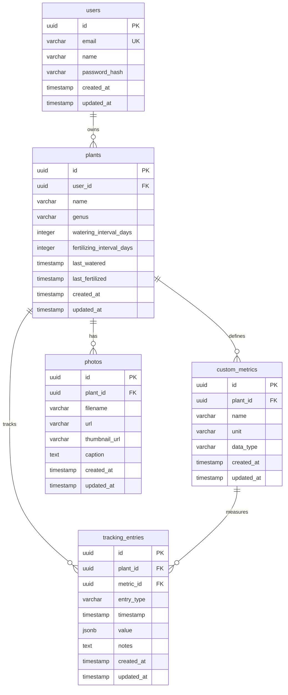

# Planty Database Schema

This document describes the database schema for the Planty application. The schema is designed to be compatible with both SQLite (for development) and PostgreSQL (for production).

## Entity Relationship Diagram



## Table Descriptions

### users
Core user accounts for the application.
- `id`: Primary key (UUID)
- `email`: Unique email address for login
- `name`: Display name
- `password_hash`: Bcrypt hashed password
- `created_at`, `updated_at`: Audit timestamps

### plants
Individual plants owned by users.
- `id`: Primary key (UUID)
- `user_id`: Foreign key to users table
- `name`: Common name of the plant
- `genus`: Scientific genus
- `watering_interval_days`: How often to water (in days)
- `fertilizing_interval_days`: How often to fertilize (in days)
- `last_watered`, `last_fertilized`: Last care timestamps
- `created_at`, `updated_at`: Audit timestamps

### custom_metrics
User-defined metrics for tracking plant health and growth.
- `id`: Primary key (UUID)
- `plant_id`: Foreign key to plants table
- `name`: Metric name (e.g., "Height", "Leaf Count")
- `unit`: Unit of measurement (e.g., "cm", "count")
- `data_type`: Type of value (number, text, boolean)
- `created_at`, `updated_at`: Audit timestamps

### photos
Photos of plants for visual tracking.
- `id`: Primary key (UUID)
- `plant_id`: Foreign key to plants table
- `filename`: Original filename
- `url`: Full-size image URL
- `thumbnail_url`: Thumbnail image URL
- `caption`: Optional photo description
- `created_at`, `updated_at`: Audit timestamps

### tracking_entries
Individual tracking events for plants (watering, fertilizing, measurements).
- `id`: Primary key (UUID)
- `plant_id`: Foreign key to plants table
- `metric_id`: Optional foreign key to custom_metrics table
- `entry_type`: Type of entry (watering, fertilizing, measurement)
- `timestamp`: When the event occurred
- `value`: JSON value for measurements (flexible data type)
- `notes`: Optional text notes
- `created_at`, `updated_at`: Audit timestamps

## Design Principles

1. **UUID Primary Keys**: All tables use UUIDs for better distributed system compatibility
2. **Soft Foreign Keys**: Designed to work with both SQLite and PostgreSQL
3. **Flexible Metrics**: JSON value field allows for different data types
4. **Audit Trails**: All tables include created_at and updated_at timestamps
5. **User Isolation**: All plant data is scoped to individual users

## Migration Strategy

Migrations are stored in `migrations/` and can be run with:
```bash
sqlx migrate run
```

The schema supports both SQLite (for development) and PostgreSQL (for production) through careful type selection and SQLx's cross-database compatibility features.